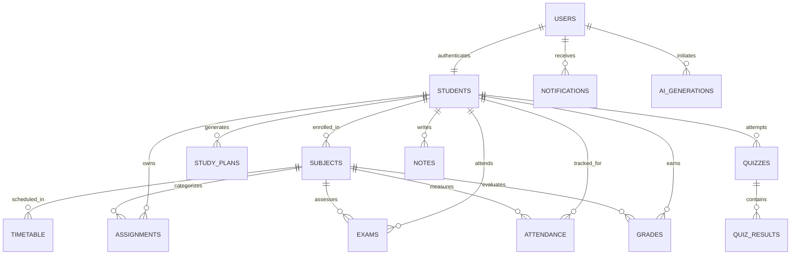

# üéì AcademiaAI - Next-Gen Student Academic Management & AI Study Assistant

<div align="center">

](https://www.typescriptlang.org/)
[](https://reactjs.org/)
[](https://tailwindcss.com/)
[](https://expressjs.com/)
[](https://firebase.google.com/)
[](https://ai.google.dev/)
[](https://opensource.org/licenses/MIT)

**An enterprise-grade, portfolio-ready academic assistant designed for university students to streamline timetables, assignments, exams, attendance rules, GPA calculation, and AI-powered revision with Google Gemini.**

[Features](#-key-features) • [Architecture](#-system-architecture) • [Database Design](#-database-design--firebase-firestore) • [API Documentation](#-api-documentation) • [Quickstart](#-quickstart-guide)

</div>

---

## üåü Project Highlights

- üîê **Secure Authentication**: JWT-based bearer authentication with Bcrypt password hashing, role guard (`STUDENT` & `ADMIN`), and protected client routes.
- üìä **Executive Dashboard**: Today's classes timeline, upcoming assignments, live countdown exam clocks, overall attendance gauge, semester/cumulative GPA, and daily AI study task checklist.
- üìÖ **Dynamic Timetable**: Weekly grid & daily focused schedules with timetable clash detection and class categorization (Lecture, Practical Lab, Tutorial, Seminar).
- üìù **Interactive Assignment Management**: Kanban board & table views, priority status tagging (Low, Medium, High), and due-date countdown math.
- ⏰ **Examination Hub & Live Countdowns**: Live ticking countdown clocks (e.g., `🔴 Database Midterm – 3 days remaining`), locations, and syllabus focus notes.
- üìä **Automated GPA Calculator & Simulator**: Standard 4.0 grading scale, automatic Semester GPA & Cumulative Overall GPA math, and "What-If" semester grade projection simulator.
- üìà **Smart Attendance Tracker with Configurable Rules**: Subject-wise class logging (`+1 Present`, `+1 Absent`), configurable university minimum attendance threshold (e.g., 80% or 75%), safety margin calculations, and warnings.
- 🤖🔥 **Gemini AI Study Planner**: Tailored 7-day personalized study schedule taking into account enrolled modules, exam deadlines, daily available hours, and targeted weak subjects.
- üìö **AI Lecture Notes Summarizer**: Transforms extensive lecture transcripts and slides into an executive summary, key concepts, terminology definitions, and high-yield exam tips.
- 🧠 **AI Interactive Quiz Generator**: Generates MCQs from topics/notes with instant scoring, timers, confetti celebrations, and in-depth rationales for correct/incorrect answers.
- 📆 **RFC 5545 Calendar Export (.ics)**: 1-click export of timetable classes, assignment due dates, and exam schedules into Google Calendar, Apple Calendar, or Microsoft Outlook.
- üìä **Rich Academic Analytics**: Recharts-powered data visualizations for weekly study time distribution, attendance compliance, assignment status, and semester GPA progression.
- üåô **Dark & Light Mode**: Seamless theme switching with persistent state saved in `localStorage`.
- ⭐ **Enterprise Admin Dashboard**: Administrative telemetry, active user management, role elevation, and AI query monitoring.

---

## 🏗️ System Architecture

```
                      ┌────────────────────────────────────────┐
                      │          React 19 + TypeScript         │
                      │    Tailwind CSS + Recharts + Lucide    │
                      └───────────────────┬────────────────────┘
                                          │
                                       REST API
                                (Bearer JWT & JSON Payloads)
                                          │
                      ┌───────────────────▼────────────────────┐
                      │         Node.js / Express API          │
                      │   Auth Guard • Cal RFC5545 • Cache     │
                      └──────────────┬──────────────────┬──────┘
                                     │                  │
                ┌────────────────────┴───┐          ┌───┴────────────────┐
                │                        │          │                    │
        ┌───────▼────────┐      ┌────────▼────────┐ │    ┌───────────────▼──┐
        │Firebase Firestore│    │ Local Fallback  │ │    │ Google Gemini AI │
        │(Admin SDK v13) │      │ Persistent Store│ │    │ (Flash / Pro)    │
        └────────────────┘      └─────────────────┘ │    └──────────────────┘
```

---

## 🗄️ Database Design & Firebase Firestore

AcademiaAI is powered by **Google Firebase Cloud Firestore** (with support for both live Cloud Firestore and an embedded persistent store for instant offline testing).

- **Security Rules**: Production rules with authentication and document-level authorization in [`database/firebase/firestore.rules`](file:///database/firebase/firestore.rules).
- **Composite Indexes**: Optimized multi-field indexes defined in [`database/firebase/firestore.indexes.json`](file:///database/firebase/firestore.indexes.json).
- **Schema & Data Dictionary**: Detailed documentation in [`database/firebase/FIRESTORE_SCHEMA.md`](file:///database/firebase/FIRESTORE_SCHEMA.md).
- **Seed Data**: Pre-structured JSON records in [`database/firebase/seed_data.json`](file:///database/firebase/seed_data.json).îÄ‚îÄ‚îĂîÄ‚îÄ‚îÄ‚îê          ‚îå‚îÄ‚îÄ‚îĂîÄ‚îÄ‚îÄ‚îÄ‚îÄ‚îÄ‚îÄ‚îÄ‚îÄ‚îÄ‚îÄ‚îÄ‚îÄ‚îÄ‚îÄ‚îÄ‚îê
                │                        │          │                    │
        ┌───────▼────────┐      ┌────────▼────────┐ │    ┌───────────────▼──┐
        │  Oracle 19c/23ai│      │ Local Fallback  │ │    │ Google Gemini AI │
        │  (oracledb Thin)│      │  Persistent DB  │ │    │ (Flash / Pro)    │
        └────────────────┘      └─────────────────┘ │    └──────────────────┘
```

---

## 🗄️ Oracle Database Design

AcademiaAI adheres to **Third Normal Form (3NF)** relational database standards. Full Oracle DDL scripts with tables, constraints, foreign keys with cascading deletions, sequences, and indexes are located in [`database/oracle/schema.sql`](file:///database/oracle/schema.sql).

### Relational Entity-Relationship (ER) Overview



> [!TIP]
> View the complete data dictionary, constraints, and relational mappings in [`database/oracle/ER_DIAGRAM.md`](file:///database/oracle/ER_DIAGRAM.md).

---

## üöÄ Quickstart Guide

### Prerequisites
- [Node.js](https://nodejs.org/) v18 or higher (v24 recommended)
- [npm](https://www.npmjs.com/) v9 or higher

### 1. Installation

Clone the repository and install all root, backend, and frontend dependencies with a single command:

```bash
npm run install:all
```

### 2. Environment Variables

Create your `.env` file in the `server` directory (a pre-configured template is available at `server/.env.example`):

```bash
cp server/.env.example server/.env
```

Configurable variables:
```env
PORT=5000
NODE_ENV=development
JWT_SECRET=academia_ai_super_secret_jwt_key_2026_portfolio
JWT_EXPIRES_IN=7d

# Oracle Database Connection (Optional: if omitted, automatic persistent local engine is used)
DB_TYPE=oracle
ORACLE_USER=academia_admin
ORACLE_PASSWORD=YourPassword123#
ORACLE_CONNECTION_STRING=localhost:1521/XEPDB1

# Gemini AI Key (Optional: intelligent offline fallbacks are included for offline testing)
GEMINI_API_KEY=your_gemini_api_key_here
```

### 3. Run Development Servers

Launch backend and frontend concurrently:

```bash
# Terminal 1: Start Backend API (Port 5000)
npm run dev:server

# Terminal 2: Start Frontend UI (Port 5173)
npm run dev:client
```

Open your browser and navigate to **`http://localhost:5173`**.

---

## 👤 Quick Demo Credentials

For rapid evaluator access, the login page features 1-click **"Demo Student"** and **"Demo Admin"** credentials:

| Role | Email | Password | Access Privileges |
|---|---|---|---|
| **Student (Default)** | `student@academia.edu` | `password123` | Full Academic & AI Hub, Timetable, GPA, Exams |
| **Administrator** | `admin@academia.edu` | `password123` | Full System Telemetry, User Management, AI Audits |

---

## üì° API Documentation

| Method | Endpoint | Description | Auth Required |
|---|---|---|:---:|
| `POST` | `/api/auth/register` | Register new user & student profile | ‚ùå |
| `POST` | `/api/auth/login` | Authenticate & issue JWT | ‚ùå |
| `GET` | `/api/auth/me` | Fetch authenticated profile | ‚úÖ |
| `PUT` | `/api/auth/profile` | Update student profile data | ‚úÖ |
| `POST` | `/api/auth/change-password` | Change account password | ‚úÖ |
| `GET` | `/api/dashboard/summary` | Consolidated dashboard payload | ‚úÖ |
| `GET` | `/api/timetable` | List timetable schedules & subjects | ‚úÖ |
| `POST` | `/api/timetable` | Add class with clash detection | ‚úÖ |
| `PUT` | `/api/timetable/:id` | Update class schedule | ‚úÖ |
| `DELETE` | `/api/timetable/:id` | Delete class schedule | ‚úÖ |
| `GET` | `/api/assignments` | List assignments | ‚úÖ |
| `POST` | `/api/assignments` | Create assignment | ‚úÖ |
| `PUT` | `/api/assignments/:id` | Update assignment status/details | ‚úÖ |
| `DELETE` | `/api/assignments/:id` | Delete assignment | ‚úÖ |
| `GET` | `/api/exams` | List exams with live countdowns | ‚úÖ |
| `POST` | `/api/exams` | Schedule examination | ‚úÖ |
| `GET` | `/api/gpa` | Calculate Semester & Overall GPA | ‚úÖ |
| `POST` | `/api/gpa/grades` | Record module grade | ‚úÖ |
| `GET` | `/api/attendance` | List subject attendance records | ‚úÖ |
| `POST` | `/api/attendance/:id/mark` | Fast mark (`present` / `absent`) | ‚úÖ |
| `PUT` | `/api/attendance/:id/rule` | Configure minimum required % threshold | ‚úÖ |
| `POST` | `/api/ai/study-plan` | Generate AI study plan with Gemini | ‚úÖ |
| `PATCH` | `/api/ai/study-plan/:planId/task/:taskId` | Toggle completion of study task | ‚úÖ |
| `POST` | `/api/ai/summarize-notes` | Synthesize lecture notes & tips | ‚úÖ |
| `POST` | `/api/ai/quiz/generate` | Generate interactive MCQs | ‚úÖ |
| `POST` | `/api/ai/quiz/:id/submit` | Grade MCQ submission & explain | ‚úÖ |
| `GET` | `/api/calendar/export.ics` | Download RFC 5545 iCalendar file | ‚úÖ |
| `GET` | `/api/admin/stats` | System telemetry & Oracle health | ‚úÖ (Admin) |
| `GET` | `/api/admin/users` | List all registered users | ‚úÖ (Admin) |
| `PUT` | `/api/admin/users/:id` | Toggle user status / role | ‚úÖ (Admin) |

---

## 🛡️ Engineering Best Practices Implemented

- **Dual-Engine Persistence**: Instant zero-configuration local run mode with seamless toggle to live Oracle Database.
- **Relational Integrity**: Pure Oracle SQL with foreign keys, cascading triggers, and indexing.
- **Defensive Error Handling**: Structured error responses, loading skeletons, and empty state fallbacks across all UI views.
- **Active Recall AI Integration**: Gemini prompts conditioned to return strictly valid JSON schemas with heuristic offline fallbacks.
- **Mobile First Responsive Design**: Optimized for all device viewports from mobile smartphones to ultra-wide desktop monitors.

---

<div align="center">
  <b>Built with ❤️ by the AcademiaAI Engineering Team</b>
</div>
