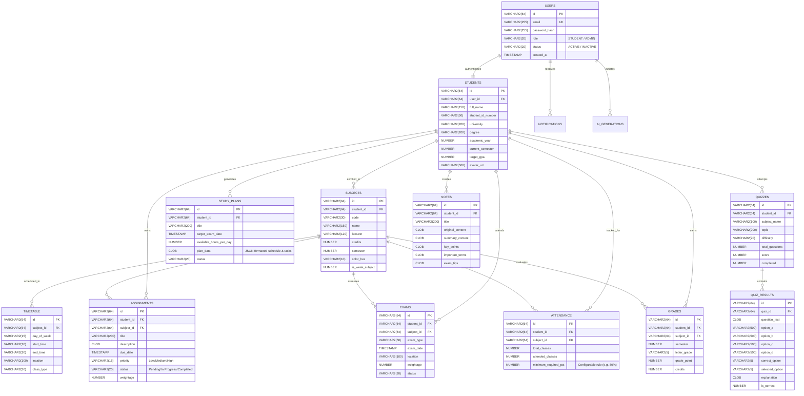

# AcademiaAI - Entity Relationship (ER) Diagram & Data Dictionary

This document details the relational database architecture designed for **Oracle Database 19c / 21c / 23ai** and enterprise student management standards.

---

## Entity Relationship Diagram

---

## Key Relational Design Principles Implemented

1. **Third Normal Form (3NF)**: Redundancy is minimized. User authentication is isolated from Student personal/academic attributes.
2. **Cascading Integrity**: Foreign keys define `ON DELETE CASCADE` so deleting a user or subject cleans up dependent schedules, attendance records, and assignments cleanly.
3. **Indexing Strategy**: B-Tree indexes on `student_id`, `subject_id`, `due_date`, and `exam_date` guarantee rapid query execution even with tens of thousands of student records.
4. **Data Verification Constraints**: `CHECK` constraints on GPA bounds (0.00 - 4.00), attendance counts (`attended <= total`), and enum sets (`status`, `priority`).
